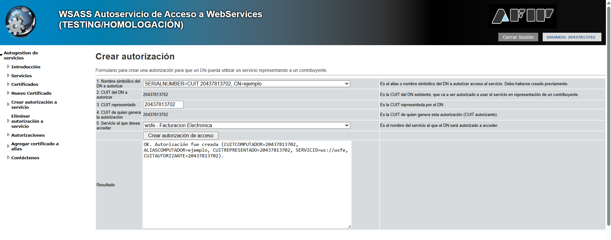

# Pedir credenciales AFIP-ARCA de forma automatizada  

**Primero debemos generar la clave privada**  
**Despues debemos generar La solicitud del certificado**  
Las peticiones se hacen de forma automatica, solo deberemos hacer un par de cosad manuales para dejar todo listo.

## Pasos para obtener certificados y dar autorización  

**Nos dirigimos a [AFIP](https://www.afip.gob.ar/landing/default.asp), ingresamos a nuestra cuenta**

**Nos saldra una pagina asi, buscamos WSA(testing), entramos**  

**Vamos a la parte de nuevo certificado ubicado a la izquierda**  
  
pegamos el contenido del certificado y le damos a Crear DN y obtener certificado.  
Copiamos todo el resiltado, desde -----BEGIN CERTIFICATE----- hasta -----END CERTIFICATE----- (incluidos).  
Luego en nuestra computadora creamos un archivo certificado-afip.crt y pegamos el contenido dentro (pueden usar bloc de notas para hacerlo).  

**Autorizar el servicio**  
Teniendo el certificado-afip.crt tenemos que autorizar a nuestra aplicación para poder facturar, vamos a la opcion Crear autorizacion a servicio:
  
solo debemos seleccionar el servicio que queremos autorizar, en este caso la facturación electronica y le damos autorizar.  
